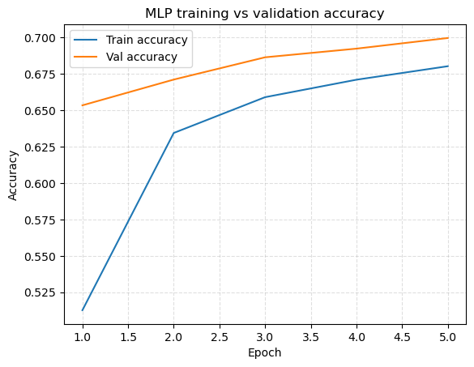
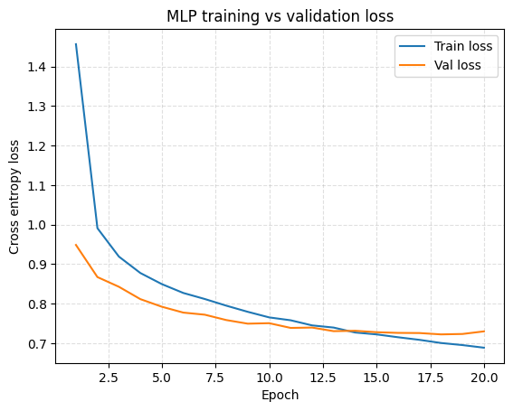
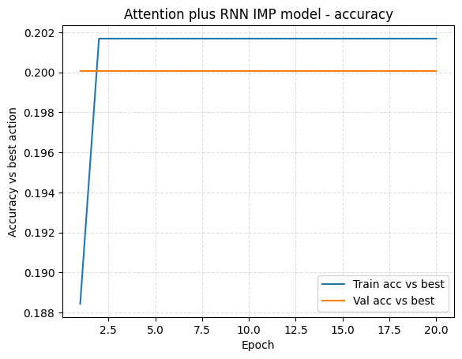
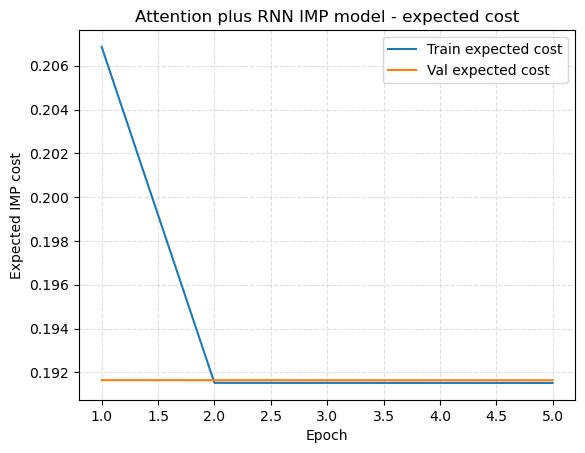

# Bridge Bidding Bot: Supervised and IMP optimized models for contract bridge

This project trains and evaluates machine learning models for contract bridge bidding using a dataset of simulated deals with expert style IMP (International Match Points) costs. Given a representation of the North South hands, the models choose a bid from a fixed set of 36 possible actions and are evaluated on both accuracy and IMP performance.

---

## What it Does

The system takes a 104 dimensional binary feature vector representing a North South pair, where each bit encodes whether a specific card is held by North or South (or neither of them). Using this input, the project trains several bidders that map hands to one of 36 bidding actions. It includes a strong supervised MLP model trained with cross entropy on labeled best actions, a custom hybrid attention plus RNN model that uses suit based tokens and optimizes expected IMP loss directly, and simple baselines such as random uniform and majority best action. The code loads the `.mat` datasets from chihkuanyeh's "Automatic-Bridge-Bidding-by-Deep-Reinforcement-Learning" github repository, trains the models, evaluates them on a held out test set, and produces plots and summary tables to compare performance.

---

## Quick Start

### I recommend to reproduce experiments in Google Colab

1. Open the notebook in this repository:

   - `notebooks/bridge_bidding_full_pipeline.ipynb`

2. In Google Colab:

   - Go to **Runtime → Change runtime type → (any GPU you have access to)**

3. Run the first notebook cell to:

   - Clone this repository into Colab  
   - Install the required Python packages

4. Run all remaining cells in order. The notebook will:

   - Train the supervised MLP baseline and save `models/mlp_baseline.pt`  
   - Plot MLP training curves (`docs/mlp_loss_curves.png`, `docs/mlp_acc_curves.png`)  
   - Run a small MLP hyperparameter and optimizer sweep and save `docs/sweep_results.csv`  
   - Train the suit based attention plus RNN model (hybrid) with IMP loss and save `models/attn_rnn_imps.pt`  
   - Plot hybrid training curves (`docs/attn_rnn_imps_loss_curves.png`, `docs/attn_rnn_imps_acc_curves.png`)  
   - Evaluate all models and baselines on IMP metrics and print a comparison table

## Video Links
[Download or play demo video](videos/project_demo.mp4)

[Download or play technical walkthrough video](videos/technical_walkthrough.mp4)

## Evaluation

### IMP based comparison on the test set

| Model                  | Avg expected cost | Avg best cost | Avg regret | Acc vs best |
|:-----------------------|------------------:|--------------:|-----------:|------------:|
| Random uniform         |            0.4772 |         0.0000|     0.4772 |      0.0521 |
| Majority best action   |            0.1997 |         0.0000|     0.1997 |      0.1829 |
| MLP (cross entropy)    |            0.0871 |         0.0000|     0.0871 |      0.6301 |
| Attn+RNN (IMP trained) |            0.1997 |         0.0000|     0.1997 |      0.1829 |

   

   

   

   

## Individual Contributions
   - N/A (This was an individual project)
